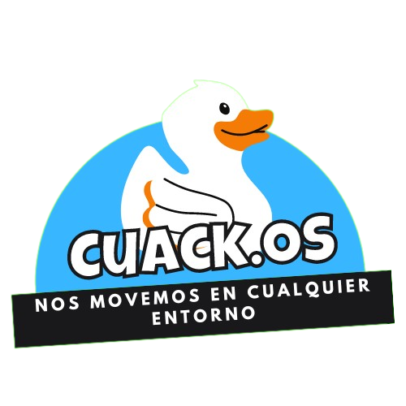

  

 <strong>Un virus de paaatooooss 🦆</strong>

La creación de un virus controlado llamado **CuackV**. Este virus ha sido diseñado para mostrar cómo funciona un virus y las distintas acciones que puede realizar, sin afectar la integridad del sistema principal. **CuackV** cuenta con diferentes modos y acciones que pueden causar ciertas molestias al usuario, pero no daña los archivos del sistema. **Este proyecto busca fomentar la conciencia y la prevención contra los virus informáticos.**

Acciones actuales:
- Auto inicio de Goose Desktop
- Eliminación de carpetas de usuario(Desktop, Downloads, Pictures, Videos), *Desactivada actualmente*
- Cambio de fondo de pantalla
- Generar archivos con un peso aleatorio en el escritorio
- Agregar carpetas vacias con nombres sobre patos
- Memes de inicio sobre patos 

Acciones Pendientes: 
- Una opción para seleccionar el tipo de daño en el sistema
- Una ventana con la opción de eliminar, pero que salta cada vez que se quiere eliminar

Ultimas Actualizaciones:
- Creación del virus en modo segundo plano sin mostrar cmd y permitir que el usuario lo cierre

